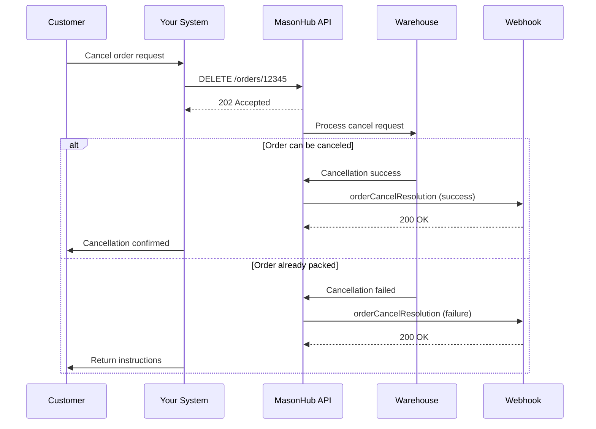

Order Cancel Resolution events notify you of the success or failure of order cancellation requests. When you submit a cancel request, this event confirms whether the cancellation was processed or if the order was already too far in fulfillment.

<Note>
Orders can only be canceled before they are packed. Once packing begins, cancellation requests will fail.
</Note>

## Event Payload

```json
{
  "callback_url": "https://client.com/api/orderCancelResolution",
  "message_type": "orderCancelResolution",
  "message_id": "0896116f-e54b-4756-9d3e-1b0c4a25d821",
  "data": [
    {
      "id": "0b744e29-b668-4486-85dd-82528b5da0dd",
      "customer_order_id": "12345",
      "status": "failure",
      "reason": "Order already packed",
      "created_at": "2018-08-05T17:32:28Z",
      "updated_at": "2018-08-05T17:32:28Z"
    }
  ]
}
```

## Payload Fields

<ResponseField name="callback_url" type="string">
  Your registered webhook endpoint URL
</ResponseField>

<ResponseField name="message_type" type="string">
  Always `orderCancelResolution` for this event type
</ResponseField>

<ResponseField name="message_id" type="string">
  Unique identifier for this event. Use for idempotency checks.
</ResponseField>

<ResponseField name="data" type="array">
  Array of cancel resolution records. Each record contains:

  <Expandable title="Resolution Data">
    <ResponseField name="id" type="string">
      MasonHub UUID for the cancel request
    </ResponseField>

    <ResponseField name="customer_order_id" type="string">
      Your order identifier
    </ResponseField>

    <ResponseField name="status" type="string">
      Resolution status: `success` or `failure`
    </ResponseField>

    <ResponseField name="reason" type="string" optional>
      Failure reason if status is `failure`. Null if successful.
    </ResponseField>

    <ResponseField name="created_at" type="string">
      Timestamp when the cancel request was created (RFC3339)
    </ResponseField>

    <ResponseField name="updated_at" type="string">
      Timestamp when the resolution was determined (RFC3339)
    </ResponseField>
  </Expandable>
</ResponseField>

## Resolution Status Values

<CardGroup cols={2}>
  <Card title="Success" icon="circle-check">
    Order was successfully canceled and inventory released
  </Card>
  <Card title="Failure" icon="circle-xmark">
    Order could not be canceled (reason provided)
  </Card>
</CardGroup>

## Common Failure Reasons

| Reason | Description | Action |
|--------|-------------|--------|
| `Order already packed` | Order is packed and ready to ship | Cannot cancel - initiate RMA after delivery |
| `Order already shipped` | Order has been shipped | Cannot cancel - process return via RMA |
| `Order already canceled` | Order was previously canceled | No action needed |
| `Order not found` | Order doesn't exist in system | Verify order ID |

## Cancellation Window

Orders can only be canceled during these stages:

<Steps>
  <Step title="Order Received">
    Order has been transmitted to MasonHub - Cancellation available ✓
  </Step>
  <Step title="At Warehouse">
    Order received at distribution center - Cancellation available ✓
  </Step>
  <Step title="In Process">
    Order being picked - Cancellation may be available (time-sensitive) ⚠️
  </Step>
  <Step title="Packed">
    Order packed and ready to ship - Cancellation NOT available ✗
  </Step>
  <Step title="Fulfilled">
    Order shipped - Cancellation NOT available ✗
  </Step>
</Steps>

## Example Payloads

### Successful Cancellation

```json
{
  "message_type": "orderCancelResolution",
  "message_id": "abc123",
  "data": [
    {
      "id": "0b744e29-b668-4486-85dd-82528b5da0dd",
      "customer_order_id": "12345",
      "status": "success",
      "reason": null,
      "created_at": "2018-08-05T17:32:28Z",
      "updated_at": "2018-08-05T17:32:30Z"
    }
  ]
}
```

### Failed Cancellation

```json
{
  "message_type": "orderCancelResolution",
  "message_id": "def456",
  "data": [
    {
      "id": "1c855f30-c779-5597-96ee-93639c6eb0ee",
      "customer_order_id": "67890",
      "status": "failure",
      "reason": "Order already packed",
      "created_at": "2018-08-05T17:45:10Z",
      "updated_at": "2018-08-05T17:45:12Z"
    }
  ]
}
```

## Implementation Example

```python Python
@app.route('/api/orderCancelResolution', methods=['POST'])
def handle_order_cancel_resolution():
    try:
        payload = request.get_json()
        message_id = payload['message_id']

        # Check if already processed
        if is_message_processed(message_id):
            return 'OK', 200

        # Process each resolution
        for resolution in payload['data']:
            order_id = resolution['customer_order_id']
            status = resolution['status']
            reason = resolution.get('reason')

            if status == 'success':
                # Mark order as canceled
                mark_order_canceled(order_id)

                # Process refund
                process_refund(order_id)

                # Notify customer
                send_cancellation_confirmation(order_id)

                logger.info(f"Order {order_id} canceled successfully")

            else:  # failure
                # Log failure
                log_cancel_failure(order_id, reason)

                if reason == "Order already packed":
                    # Inform customer they need to return after delivery
                    notify_customer_return_required(order_id)

                    # Prepare RMA for when package arrives
                    prepare_return_label(order_id)

                elif reason == "Order already shipped":
                    # Initiate return process
                    create_rma(order_id)
                    send_return_instructions(order_id)

                logger.error(f"Order {order_id} cancel failed: {reason}")

        mark_message_processed(message_id)
        return 'OK', 200

    except Exception as e:
        logger.error(f"Cancel resolution webhook error: {e}")
        return 'Error', 500
```

```javascript JavaScript
app.post('/api/orderCancelResolution', async (req, res) => {
  try {
    const payload = req.body;
    const messageId = payload.message_id;

    // Check if already processed
    if (await isMessageProcessed(messageId)) {
      return res.status(200).send('OK');
    }

    // Process each resolution
    for (const resolution of payload.data) {
      const orderId = resolution.customer_order_id;
      const status = resolution.status;
      const reason = resolution.reason;

      if (status === 'success') {
        // Mark order as canceled
        await markOrderCanceled(orderId);

        // Process refund
        await processRefund(orderId);

        // Notify customer
        await sendCancellationConfirmation(orderId);

        console.log(`Order ${orderId} canceled successfully`);

      } else {
        // Log failure
        await logCancelFailure(orderId, reason);

        if (reason === 'Order already packed') {
          // Customer needs to return after delivery
          await notifyCustomerReturnRequired(orderId);
          await prepareReturnLabel(orderId);

        } else if (reason === 'Order already shipped') {
          // Initiate return process
          await createRMA(orderId);
          await sendReturnInstructions(orderId);
        }

        console.error(`Order ${orderId} cancel failed: ${reason}`);
      }
    }

    await markMessageProcessed(messageId);
    res.status(200).send('OK');

  } catch (error) {
    console.error('Cancel resolution webhook error:', error);
    res.status(500).send('Error');
  }
});
```

## Cancel Request Flow

1. **Submit Cancellation** - Call `DELETE /orders/{id}` or `PUT /orders/{id}/cancel`
2. **Receive Acknowledgment** - API returns 202 Accepted
3. **Wait for Resolution** - MasonHub processes cancellation asynchronously
4. **Receive Event** - Get `orderCancelResolution` webhook with success/failure



## Use Cases

<CardGroup cols={2}>
  <Card title="Cancellation Confirmation" icon="check">
    Confirm order cancellations and process refunds
  </Card>
  <Card title="Return Fallback" icon="rotate-left">
    Automatically prepare RMA for failed cancellations
  </Card>
  <Card title="Customer Communication" icon="envelope">
    Inform customers of cancellation status
  </Card>
  <Card title="Refund Processing" icon="dollar-sign">
    Trigger refunds only after successful cancellation
  </Card>
</CardGroup>

## Best Practices

<CardGroup cols={2}>
  <Card title="Cancel Immediately" icon="bolt">
    Submit cancellation requests as soon as customer requests to maximize success
  </Card>
  <Card title="Have RMA Fallback" icon="shield-check">
    Automatically prepare returns for failed cancellations
  </Card>
  <Card title="Process Refunds Correctly" icon="receipt">
    Only refund after successful cancellation confirmation
  </Card>
  <Card title="Clear Communication" icon="comments">
    Inform customers whether they'll get a refund or need to return
  </Card>
</CardGroup>

<Warning>
Never process refunds before receiving a successful cancellation resolution. Failed cancellations mean the order shipped and requires a return.
</Warning>

## Cancellation Tips

### Maximize Success Rate

1. **Submit cancellations immediately** when customers request
2. **Monitor order status** - Don't attempt to cancel packed/shipped orders
3. **Check order events** - Use real-time order events to track fulfillment stage
4. **Set customer expectations** - Inform them cancellations aren't guaranteed

### Handle Failures Gracefully

1. **Prepare return labels** automatically for failed cancellations
2. **Send clear instructions** to customers about return process
3. **Create RMA preemptively** to streamline returns
4. **Update order status** to reflect it will be delivered

## Response Requirements

Your webhook endpoint must:

1. **Respond within 30 seconds** - Return HTTP 200 to acknowledge receipt
2. **Handle both statuses** - Implement logic for success and failure
3. **Process refunds correctly** - Only refund successful cancellations
4. **Prepare for returns** - Set up RMA flow for failed cancellations

## Related Events

- [Order Events](/api-reference/callback-events/order-events) - Monitor order status to know if cancellation is possible
- [Order Update Resolutions](/api-reference/callback-events/order-update-resolutions) - Update request confirmations
- [RMA Events](/api-reference/callback-events/RMA-events) - Handle returns for failed cancellations
