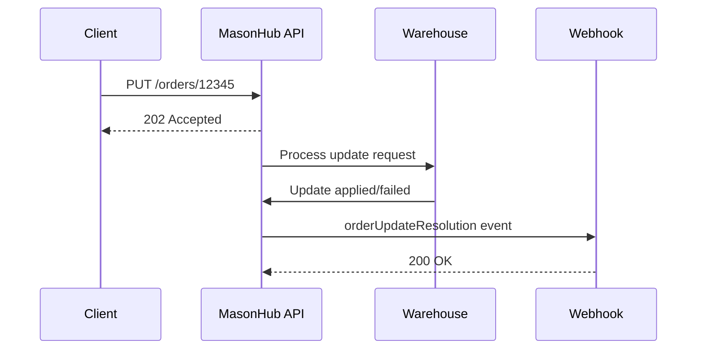

Order Update Resolution events notify you of the success or failure of asynchronous order update requests. When you submit an order update (e.g., changing shipping address or line items), this event confirms whether the update was applied.

<Note>
Order updates can only be processed before the order reaches certain fulfillment stages. Updates may fail if the order is already packed or shipped.
</Note>

## Event Payload

```json
{
  "callback_url": "https://client.com/api/orderUpdateResolution",
  "message_type": "orderUpdateResolution",
  "message_id": "0896116f-e54b-4756-9d3e-1b0c4a25d821",
  "data": [
    {
      "id": "0b744e29-b668-4486-85dd-82528b5da0dd",
      "customer_order_id": "12345",
      "status": "success",
      "reason": null,
      "created_at": "2018-08-05T17:32:28Z",
      "updated_at": "2018-08-05T17:32:28Z"
    }
  ]
}
```

## Payload Fields

<ResponseField name="callback_url" type="string">
  Your registered webhook endpoint URL
</ResponseField>

<ResponseField name="message_type" type="string">
  Always `orderUpdateResolution` for this event type
</ResponseField>

<ResponseField name="message_id" type="string">
  Unique identifier for this event. Use for idempotency checks.
</ResponseField>

<ResponseField name="data" type="array">
  Array of update resolution records. Each record contains:

  <Expandable title="Resolution Data">
    <ResponseField name="id" type="string">
      MasonHub UUID for the update request
    </ResponseField>

    <ResponseField name="customer_order_id" type="string">
      Your order identifier
    </ResponseField>

    <ResponseField name="status" type="string">
      Resolution status: `success` or `failure`
    </ResponseField>

    <ResponseField name="reason" type="string" optional>
      Failure reason if status is `failure`. Null if successful.
    </ResponseField>

    <ResponseField name="created_at" type="string">
      Timestamp when the update request was created (RFC3339)
    </ResponseField>

    <ResponseField name="updated_at" type="string">
      Timestamp when the resolution was determined (RFC3339)
    </ResponseField>
  </Expandable>
</ResponseField>

## Resolution Status Values

<CardGroup cols={2}>
  <Card title="Success" icon="circle-check">
    Order update was applied successfully
  </Card>
  <Card title="Failure" icon="circle-xmark">
    Order update could not be applied (reason provided)
  </Card>
</CardGroup>

## Common Failure Reasons

| Reason | Description | Action |
|--------|-------------|--------|
| `Order already packed` | Order is past the packing stage | Cannot update - consider canceling and reordering |
| `Order already shipped` | Order has been shipped | Cannot update - handle via RMA process |
| `Invalid shipping address` | New address is undeliverable | Verify and resubmit with valid address |
| `SKU not found` | Updated SKU doesn't exist | Verify SKU identifier and resubmit |
| `Insufficient inventory` | Updated items not available | Reduce quantity or wait for inventory |

## Example Payloads

### Successful Update

```json
{
  "message_type": "orderUpdateResolution",
  "message_id": "abc123",
  "data": [
    {
      "id": "0b744e29-b668-4486-85dd-82528b5da0dd",
      "customer_order_id": "12345",
      "status": "success",
      "reason": null,
      "created_at": "2018-08-05T17:32:28Z",
      "updated_at": "2018-08-05T17:32:30Z"
    }
  ]
}
```

### Failed Update

```json
{
  "message_type": "orderUpdateResolution",
  "message_id": "def456",
  "data": [
    {
      "id": "1c855f30-c779-5597-96ee-93639c6eb0ee",
      "customer_order_id": "67890",
      "status": "failure",
      "reason": "Order already packed",
      "created_at": "2018-08-05T17:45:10Z",
      "updated_at": "2018-08-05T17:45:12Z"
    }
  ]
}
```

## Implementation Example

```python Python
@app.route('/api/orderUpdateResolution', methods=['POST'])
def handle_order_update_resolution():
    try:
        payload = request.get_json()
        message_id = payload['message_id']

        # Check if already processed
        if is_message_processed(message_id):
            return 'OK', 200

        # Process each resolution
        for resolution in payload['data']:
            order_id = resolution['customer_order_id']
            status = resolution['status']
            reason = resolution.get('reason')

            if status == 'success':
                # Mark update as successful
                mark_order_update_success(order_id)

                # Notify customer if needed
                notify_customer_order_updated(order_id)

                logger.info(f"Order {order_id} updated successfully")

            else:  # failure
                # Log failure
                log_order_update_failure(order_id, reason)

                # Alert operations team
                alert_ops_team(order_id, reason)

                # May need to take corrective action
                if reason == "Order already packed":
                    # Consider canceling and reordering
                    initiate_order_cancel(order_id)
                elif reason == "Invalid shipping address":
                    # Request customer to provide valid address
                    request_address_correction(order_id)

                logger.error(f"Order {order_id} update failed: {reason}")

        mark_message_processed(message_id)
        return 'OK', 200

    except Exception as e:
        logger.error(f"Update resolution webhook error: {e}")
        return 'Error', 500
```

```javascript JavaScript
app.post('/api/orderUpdateResolution', async (req, res) => {
  try {
    const payload = req.body;
    const messageId = payload.message_id;

    // Check if already processed
    if (await isMessageProcessed(messageId)) {
      return res.status(200).send('OK');
    }

    // Process each resolution
    for (const resolution of payload.data) {
      const orderId = resolution.customer_order_id;
      const status = resolution.status;
      const reason = resolution.reason;

      if (status === 'success') {
        // Mark update as successful
        await markOrderUpdateSuccess(orderId);

        // Notify customer if needed
        await notifyCustomerOrderUpdated(orderId);

        console.log(`Order ${orderId} updated successfully`);

      } else {
        // Log failure
        await logOrderUpdateFailure(orderId, reason);

        // Alert operations team
        await alertOpsTeam(orderId, reason);

        // Take corrective action based on reason
        if (reason === 'Order already packed') {
          await initiateOrderCancel(orderId);
        } else if (reason === 'Invalid shipping address') {
          await requestAddressCorrection(orderId);
        }

        console.error(`Order ${orderId} update failed: ${reason}`);
      }
    }

    await markMessageProcessed(messageId);
    res.status(200).send('OK');

  } catch (error) {
    console.error('Update resolution webhook error:', error);
    res.status(500).send('Error');
  }
});
```

## Update Request Flow

1. **Submit Update** - Call `PUT /orders/{id}` with updated fields
2. **Receive Acknowledgment** - API returns 202 Accepted
3. **Wait for Resolution** - MasonHub processes the update asynchronously
4. **Receive Event** - Get `orderUpdateResolution` webhook with success/failure



## Use Cases

<CardGroup cols={2}>
  <Card title="Update Confirmation" icon="check">
    Confirm order updates were applied successfully
  </Card>
  <Card title="Failure Handling" icon="wrench">
    Implement fallback logic for failed updates
  </Card>
  <Card title="Customer Communication" icon="envelope">
    Notify customers of successful address or item changes
  </Card>
  <Card title="Operations Alerts" icon="bell">
    Alert teams when updates fail for manual intervention
  </Card>
</CardGroup>

## Best Practices

<CardGroup cols={2}>
  <Card title="Track Update Requests" icon="list-check">
    Store update request IDs to correlate with resolutions
  </Card>
  <Card title="Handle Failures Gracefully" icon="shield-halved">
    Implement fallback logic for each failure reason
  </Card>
  <Card title="Update Early" icon="clock">
    Submit updates as soon as possible - before packing stage
  </Card>
  <Card title="Validate Before Submitting" icon="circle-check">
    Validate addresses and SKUs client-side to reduce failures
  </Card>
</CardGroup>

<Warning>
Order updates have time-sensitive windows. Submit updates immediately after the customer makes changes to maximize success rate.
</Warning>

## Response Requirements

Your webhook endpoint must:

1. **Respond within 30 seconds** - Return HTTP 200 to acknowledge receipt
2. **Handle both statuses** - Implement logic for success and failure cases
3. **Correlate requests** - Match resolutions to original update requests
4. **Take corrective action** - Implement fallback logic for failures

## Related Events

- [Order Events](/api-reference/callback-events/order-events) - Order status changes and shipments
- [Order Cancel Resolutions](/api-reference/callback-events/order-cancel-resolutions) - Cancel request confirmations
